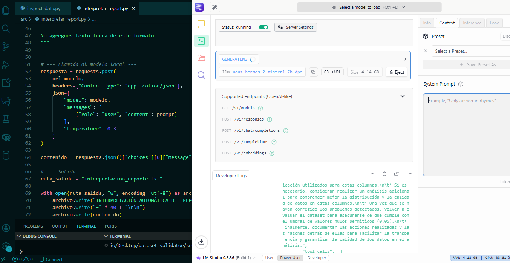

# Dataset Validator con Interpretación mediante IA Local

## Descripción general

Este proyecto presenta un ejemplo completo y accesible de un flujo de trabajo para la validación inicial de datasets, incorporando interpretación automática de resultados mediante un modelo de lenguaje ejecutado en entorno local.

El objetivo no es automatizar el análisis de datos ni reemplazar decisiones humanas, sino mostrar cómo estructurar un proceso claro, reproducible y responsable en etapas tempranas de un proyecto de análisis.

---

## Problema que aborda

En la práctica profesional, la validación inicial de datos suele realizarse de manera informal o implícita.  
Este proyecto propone una alternativa estructurada que permite:

- detectar problemas básicos de calidad de datos
- documentar decisiones
- separar reglas automáticas de interpretación humana
- generar evidencia reutilizable

---

## Alcance del sistema

El sistema realiza las siguientes tareas:

1. Analiza un dataset en formato CSV
2. Evalúa valores nulos en columnas categóricas
3. Aplica un umbral configurable
4. Toma una decisión automática:
   - **APTO**
   - **REVISAR**
5. Genera un reporte estructurado en formato JSON
6. Utiliza un modelo de lenguaje local para interpretar el reporte
7. Guarda la interpretación en un archivo de texto


---

## Qué NO hace este proyecto

- No limpia datos
- No modifica el dataset original
- No entrena modelos de machine learning
- No utiliza servicios en la nube
- No envía datos a plataformas externas

El foco está en **proceso, criterio y buenas prácticas**, no en automatización total.

---

## Uso responsable de IA

La IA utilizada en este proyecto:

- se ejecuta completamente en entorno local
- no tiene acceso al dataset original
- recibe únicamente un reporte resumido
- no toma decisiones finales
- no realiza cálculos

Su rol es **interpretar resultados**, no analizar datos crudos.

---

## Seguridad y privacidad

Todo el flujo de trabajo se ejecuta localmente en la computadora del usuario:

- los datos no salen del entorno local
- no se utilizan APIs externas
- no se requiere conexión a internet
- no se sube información a servicios de terceros

Este enfoque es adecuado para trabajar con datos sensibles o confidenciales.

---

## Estructura del proyecto
```
dataset_validator/
│
├── data/
│ └── adult.csv
│
├── src/
│ ├── inspect_data.py
│ └── interpretar_reporte.py
│
├── reporte_validacion.json
├── interpretacion_reporte.txt
└── README.md
```

---

## Requisitos

- Python 3.10 o superior
- Pandas
- Requests
- LM Studio con un modelo local compatible (por ejemplo Nous Hermes Mistral)

No se requieren cuentas, pagos ni servicios externos.

---

## Qué se espera aprender con este proyecto

Al finalizar este ejercicio, el estudiante debería ser capaz de:

- comprender la importancia de la validación inicial de datos
- aplicar reglas automáticas simples con criterio
- separar lógica de interpretación
- integrar IA de manera justificada y controlada
- pensar en términos de procesos reutilizables

---

## Público objetivo

Este proyecto está pensado para estudiantes de análisis de datos con nivel intermedio que deseen dar el primer paso hacia flujos de trabajo más estructurados sin introducir complejidad innecesaria.

---

## 🔧 Requerimientos de hardware

Para ejecutar el flujo completo de este repositorio (análisis de datos con Python y generación de reportes con IA local):  

- **Python + scripts:** la parte de Python es liviana y funciona en cualquier máquina con Python 3.x y memoria estándar.  
- **IA local (LM Studio + modelo `nous‑hermes‑2‑mistral‑7b‑dpo`):** se beneficia de hardware más potente para un rendimiento óptimo:  
  - **GPU:** ≥12 GB de VRAM para inferencia eficiente.  
  - **RAM del sistema:** 16 – 32 GB.  
  - **Almacenamiento:** SSD con espacio suficiente para modelos y datasets.  
- **Opcional:** puede ejecutarse sin GPU (solo CPU), aunque con menor velocidad.  

💡 Se recomienda usar siempre un **entorno virtual (`venv`)** para aislar dependencias y mantener el entorno seguro.

---

## Dataset

El dataset utilizado en este proyecto es **Adult Income Dataset**, disponible públicamente en Kaggle:

https://www.kaggle.com/datasets/wenruliu/adult-income-dataset

### Descripción

Este conjunto de datos contiene información demográfica y laboral de personas adultas.

Incluye variables como:
- Edad
- Nivel educativo
- Estado civil
- Tipo de trabajo
- Ocupación
- Horas trabajadas por semana
- País de origen
- Ingreso (variable objetivo)

El dataset es ampliamente utilizado con fines educativos para prácticas de:
- Análisis exploratorio de datos (EDA)
- Limpieza y validación de datos
- Preparación de datasets para modelos de machine learning
- Discusión sobre sesgos y calidad de datos

### Licencia y uso

El dataset es de acceso público y se utiliza en este proyecto **exclusivamente con fines educativos**.
No contiene información personal identificable y no se incorporan datos sensibles adicionales durante el procesamiento.


